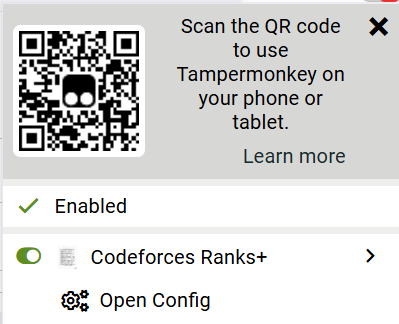

# codeforces-ranks-plus

a handful of rank colors (for ranks M, IGM, LGM, 4000)
[**click to install**](https://github.com/temporary77/codeforces-ranks-plus/raw/main/codeforces-ranks-plus-dark.user.js) (requires a userscript manager)

there are colors for both light and dark themes.
light theme colors are picked to work with default theme,
dark theme colors are picked to work with [this dark theme](https://github.com/GaurangTandon/codeforces-darktheme).

script will automatically check whether youre using a light or dark theme

## download instructions

1. install [Tampermonkey](https://tampermonkey.net/)
2. [**click this link**](https://github.com/temporary77/codeforces-ranks-plus/raw/main/codeforces-ranks-plus-dark.user.js) to install the rank colors userscript
3. **(optional)** dark theme colors are picked to work with [this dark theme](https://github.com/GaurangTandon/codeforces-darktheme). install it if you want

## config

this userscript has a config

you should be able to access it through your userscript manager menu

