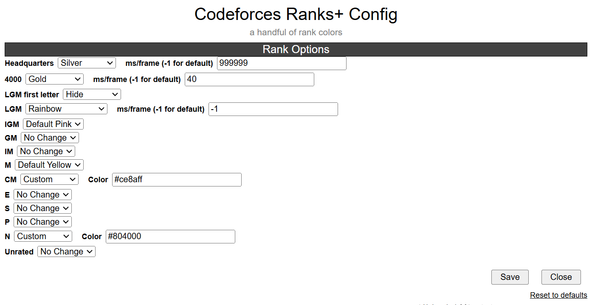

# codeforces-ranks-plus

a handful of rank colors (for ranks M, IGM, LGM, 4000)
[**click to install**](https://github.com/temporary77/codeforces-ranks-plus/raw/main/codeforces-ranks-plus.user.js) (requires a userscript manager)

there are default colors and gradients for both light and dark themes.  
light theme colors are picked to work with default theme,  
dark theme colors are picked to work with [this dark theme](https://github.com/GaurangTandon/codeforces-darktheme).

script will automatically check whether youre using a light or dark theme and use the appropriate colors

all rank colors are customizable; see screenshot below

## download instructions

1. install [Tampermonkey](https://tampermonkey.net/)
2. [**click this link**](https://github.com/temporary77/codeforces-ranks-plus/raw/main/codeforces-ranks-plus.user.js) to install the rank colors userscript
3. **(optional)** dark theme colors are picked to work with [this dark theme](https://github.com/GaurangTandon/codeforces-darktheme). install it if you want

## config

this userscript has a config

you should be able to access it through your userscript manager menu

options:

**No Change** - script will not attempt to modify color  
**Default ...** - ranks that do not have a corresponding preexistent color will have this option. its just colors i picked  
**Custom** - choose your own color  
**Gradients** - preset gradients that move. you can customize its speed via ms/frame option  

## preview

some low res gradient previews

